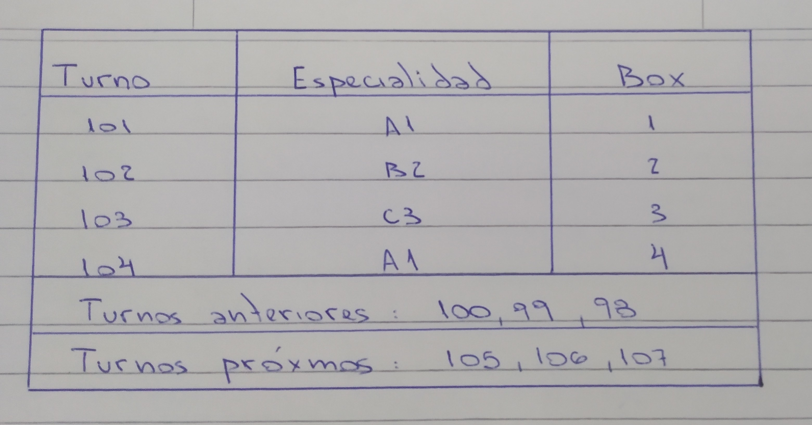
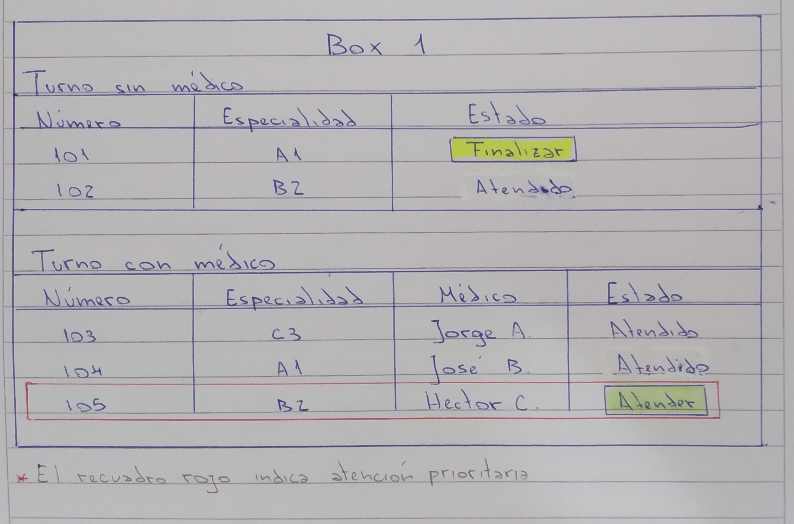
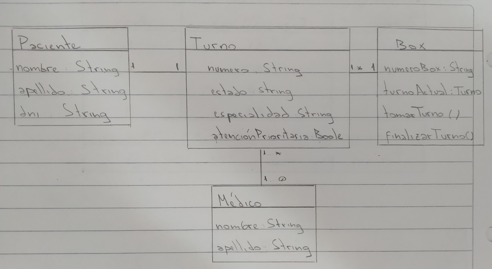
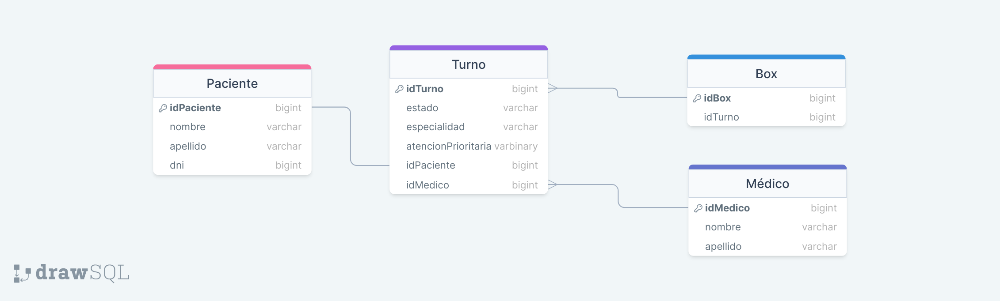

## Turnero

## Enunciado

El turnero permite a las personas que asisten a una clínica ser atendidos de manera ordenada respetando el orden de llamado.

Para ser atendidas, las personas se deben dirigir al turnero, puede que las personas tengan turno o no, se deberán identificar primero.

A. Se requiere generar un prototipo, para la pantalla que muestra los turnos, que permita a las personas conocer el orden de llamado y en que Box será atendido. Además de mostrar cuales fueron los turnos atendidos anteriormente y cuáles serán los próximos. Existen diferentes letras y números que permiten direccionar según cada especialidad.

¿Qué información sería relevante mostrar?

B. Por otro lado, cada Box de atención debería tener una interfaz con los turnos registrados (desde el turnero) y deberán poder tomar los turnos a atender respetando el orden de llegada. Desde cada box se puede tomar un turno para ser atendido. Una vez que el turno es tomado por algún box no debería estar disponible para ser tomado por los demás. Cuando una persona tenga turno con algún médico debería mostrar dicha información a la persona que está en el box de atención.

Suele ocurrir eventualmente, que la persona que saca el turno tenga alguna atención prioritaria, por ejemplo: cuando asiste quien “paga los sueldos al personal de la clínica”, en dicho caso, las personas que están en el box podrán dar una atención prioritaria salteando el orden de llegada.

## Solución

### Requerimientos funcionales:

- El sistema debe permitir a los pacientes identificarse.
- El sistema debe permitir registrar nuevos turnos con la información de los pacientes (DNI).
- El sistema debe permitir la visualización del orden de llamado y box asignado, así como los turnos atendidos previamente y próximos turnos.
- El sistema debe permitir al personal del box visualizar la lista de turnos registrados con sus correspondientes detalles.
- El sistema debe permitir al personal tomar un turno de la lista de turnos registrados.
- El sistema debe permitir al personal poder marcar un turno como atendido.
- El sistema debe permitir mostrar al personal el nombre del médico a atender el turno.
- El sistema debe permitir al personal gestionar casos de atención prioritaria, saltando el orden de llegada.

### Requerimientos no funcionales:

- Una vez tomado un turno por algún box, éste no debe estar disponible para los demás.

### Prototipo

Pantalla de turnos.

Interfaz del Box.

### Arquitectura

Si el alcance de nuestra clínica no es muy elevado inicialmente,voy a optar por utilizar la arquitectura monolítica ya que tiende a ser la más simple de desarrollar e implementar. Además, en cuanto a costos, ésta es la arquitectura más rentable para iniciar la solución y si no hay requerimientos mayores a los actuales y el sistema no espera un alto volumen de pacientes, el monolito seguirá siendo adecuado para gestionar las necesidades de la clínica. El mantenimiento de la aplicación monolítica también será más sencillo en comparación con sistemas distribuidos.

### Diagrama de clases

### Mapeo de objetos a tablas

